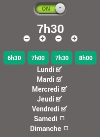
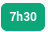
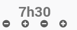

# Composant

|Nom| widgets | Rendu | Source
|------------|-------------|-----| ----
|Reveil | [reveil](#reveil) |  |[ca-sert-a-quoi.com](https://www.ca-sert-a-quoi.com/articles/domotique/tuto-creez-votre-reveil-domotique-et-scenarisez-votre-saut-du-lit/)

### Reveil
|Fichier(s) | Paramètre | Type | Sub-type| Rendu | Source |
|------------|-------------|---|---|------|----|
|aucun |  | |  |  |[images.jeedom.com](https://images.jeedom.com/archives/widget/)
|box.html | bg-color; color | action| other | |
|cmd.action.slider.timebutton.html|name_display|action|slider||[images.jeedom.com](https://images.jeedom.com/archives/widget/)
|cmd.action.slider.checkbox.html| |action| slider| 
